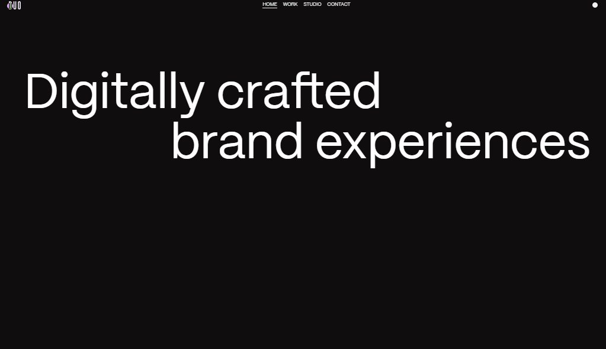

# 🎨 Duo Studio Clone

A clean and responsive clone of the [Duo Studio](https://duo-studio.co/) website — built for practice, design study, and frontend development learning.

> This project replicates the visuals and interactions of the original Duo Studio site, with a focus on animations, layout precision, and responsiveness.

---

## 🌐 Live Demo

🔗 [Visit the site on Netlify](https://duostudio-dt.netlify.app)

---

## 📂 Folder Structure

duo-studio/

├── index.html
├── style.css
├── script.js
├── README.md
├── photo.png

---

## 📱 Social Media

-   
-  
- 

---

## 🚀 Tech Stack

- HTML5  
- CSS  
- JavaScript  

---

## 🖼️ Screenshot

---

## 📜 Disclaimer

This project is created for educational and personal learning purposes.  
All credit for the original design and branding belongs to [Duo Studio](https://duo-studio.co/).
